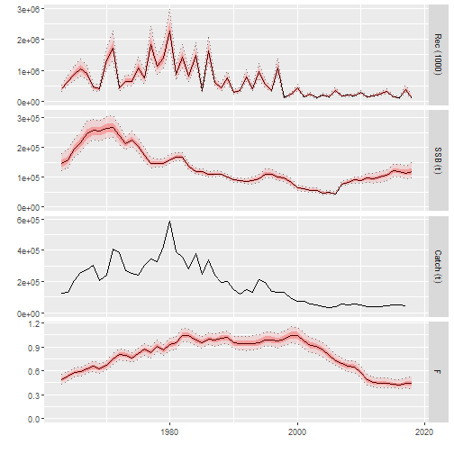
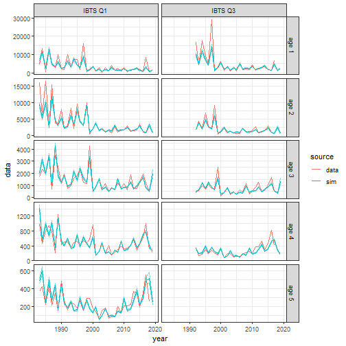
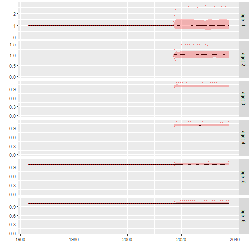

```r
### create FLStock for cod ####
### base on SAM assessment

### load packages
library(FLfse)
library(ggplotFL)
library(FLAssess)
library(FLash)
library(tidyr)
library(dplyr)

### source the scripts from functions folder
invisible(lapply(list.files(path = "functions/", pattern = "*.R$", 
                            full.names = TRUE), source))

dir.create(path = "input/cod4", recursive = TRUE)
```

```
## Warning in dir.create(path = "input/cod4", recursive = TRUE): 'input\cod4'
## already exists
```

```r
dir.create(path = "output/runs", recursive = TRUE)
```

```
## Warning in dir.create(path = "output/runs", recursive = TRUE):
## 'output\runs' already exists
```

```r
### simulation specifications ####

### number of iterations
n <- 100
### number of years
n_years <- 30

### last data year
yr_data <- 2018


### fit SAM ####
### use input data provided in FLfse
### recreates the WGNSSK2018 cod assessment
fit <- FLR_SAM(stk = cod4_stk, idx = cod4_idx, conf = cod4_conf_sam)

is(fit)
```

```
## [1] "sam"      "oldClass"
```

```r
fit
```

```
## SAM model: log likelihood is -169.7853 Convergence OK
```

```r
plot(fit)
```


```r
### remove catch multiplier for cod ####
### For the cod SAM assessment a catch multiplier is estimated for the years
### 1993-2005.
### For the simulation, we correct the catch with this multiplier and remove
### estimation of the catch multiplier 
### -> saves time in simulation (less parameters to estimate)

### get catch multiplier
ages <- fit$conf$minAge:fit$conf$maxAge
yrs <- fit$conf$keyScaledYears
catch_mult <- FLQuant(
  matrix(data = fit$pl$logScale[(fit$conf$keyParScaledYA + 1)], 
       ncol = fit$conf$noScaledYears,
       nrow = length(fit$conf$minAge:fit$conf$maxAge),
       byrow = TRUE), 
       dimnames = list(year = fit$conf$keyScaledYears, 
                       age = fit$conf$minAge:fit$conf$maxAge))
catch_mult <- exp(catch_mult)

cod4_stk2 <- cod4_stk
### correct catch.n
catch.n(cod4_stk2)[ac(ages), ac(yrs)] <- catch.n(cod4_stk2)[ac(ages), ac(yrs)] *
  catch_mult
### split into landings and discards, based on landing fraction
landings.n(cod4_stk2)[ac(ages), ac(yrs)] <- catch.n(cod4_stk2)[ac(ages), ac(yrs)] *
  (landings.n(cod4_stk)[ac(ages), ac(yrs)] / catch.n(cod4_stk)[ac(ages), ac(yrs)])
discards.n(cod4_stk2)[ac(ages), ac(yrs)] <- catch.n(cod4_stk2)[ac(ages), ac(yrs)] *
  (1 - landings.n(cod4_stk)[ac(ages), ac(yrs)] / 
     catch.n(cod4_stk)[ac(ages), ac(yrs)])
### update stock
catch(cod4_stk2)[, ac(yrs)] <- computeCatch(cod4_stk2)[, ac(yrs)]
landings(cod4_stk2)[, ac(yrs)] <- computeLandings(cod4_stk2)[, ac(yrs)]
discards(cod4_stk2)[, ac(yrs)] <- computeDiscards(cod4_stk2)[, ac(yrs)]

### fit SAM to "corrected" catches
fit2 <- FLR_SAM(stk = cod4_stk2, idx = cod4_idx, 
                conf = cod4_conf_sam[!names(cod4_conf_sam) %in% 
                                       c("noScaledYears", "keyScaledYears",
                                         "keyParScaledYA")])
### compare results
summary(fit2) / summary(fit)
```

```
##      R(age 1)      Low      High SSB      Low      High Fbar(2-4)      Low
## 1963        1 1.000041 0.9999581   1 1.002028 0.9979721         1 1.000000
## 1964        1 1.000108 0.9998917   1 1.001807 0.9981933         1 1.000000
## 1965        1 1.000049 0.9999516   1 1.001456 0.9985430         1 1.000000
## 1966        1 1.000015 0.9999849   1 1.001530 0.9984758         1 1.000000
## 1967        1 1.000028 0.9999713   1 1.001420 0.9985851         1 1.000000
## 1968        1 1.000061 0.9999367   1 1.001036 0.9989625         1 1.000000
## 1969        1 1.000141 0.9998617   1 1.001384 0.9986216         1 1.000000
## 1970        1 1.000014 0.9999862   1 1.001566 0.9984326         1 1.000000
## 1971        1 1.000070 0.9999297   1 1.001469 0.9985311         1 1.000000
## 1972        1 1.000052 0.9999493   1 1.001394 0.9986070         1 1.000000
## 1973        1 1.000026 0.9999749   1 1.001167 0.9988327         1 1.000000
## 1974        1 1.000020 0.9999805   1 1.001364 0.9986452         1 1.000000
## 1975        1 1.000212 0.9997879   1 1.001475 0.9985304         1 1.000000
## 1976        1 1.000209 0.9997920   1 1.002040 0.9979638         1 1.000000
## 1977        1 1.000136 0.9998636   1 1.002267 0.9977457         1 1.000000
## 1978        1 1.000215 0.9997857   1 1.001469 0.9985296         1 1.000000
## 1979        1 1.000028 0.9999724   1 1.001758 0.9982386         1 1.000000
## 1980        1 1.000042 0.9999575   1 1.001711 0.9982955         1 1.000000
## 1981        1 1.000043 0.9999560   1 1.001658 0.9983419         1 1.000000
## 1982        1 1.000449 0.9995509   1 1.001768 0.9982378         1 1.000000
## 1983        1 1.000371 0.9996287   1 1.002801 0.9972036         1 1.000000
## 1984        1 1.000688 0.9993120   1 1.003625 0.9963900         1 1.000000
## 1985        1 1.000384 0.9996175   1 1.004309 0.9957120         1 1.000000
## 1986        1 1.000539 0.9994619   1 1.003957 0.9960524         1 1.000000
## 1987        1 1.000296 0.9997041   1 1.004097 0.9959203         1 1.001115
## 1988        1 1.000410 0.9995892   1 1.003571 0.9964454         1 1.000000
## 1989        1 1.000899 0.9991024   1 1.004807 0.9952163         1 1.001078
## 1990        1 1.000553 0.9994504   1 1.006985 0.9930695         1 1.002307
## 1991        1 1.004441 0.9955779   1 1.010287 0.9898151         1 1.007034
## 1992        1 1.012672 0.9874876   1 1.021008 0.9794174         1 1.015458
## 1993        1 1.016080 0.9841747   1 1.079715 0.9261619         1 1.023753
## 1994        1 1.022641 0.9778607   1 1.095669 0.9126876         1 1.026964
## 1995        1 1.021278 0.9791636   1 1.098055 0.9106904         1 1.027180
## 1996        1 1.018857 0.9814916   1 1.100446 0.9087187         1 1.028377
## 1997        1 1.021910 0.9785600   1 1.092877 0.9150301         1 1.027618
## 1998        1 1.014944 0.9852754   1 1.084269 0.9222834         1 1.027996
## 1999        1 1.018876 0.9814746   1 1.102453 0.9070636         1 1.027957
## 2000        1 1.018058 0.9822651   1 1.089798 0.9175960         1 1.028078
## 2001        1 1.017677 0.9826381   1 1.081180 0.9249072         1 1.025316
## 2002        1 1.017866 0.9824446   1 1.084628 0.9219635         1 1.028049
## 2003        1 1.013918 0.9862789   1 1.085143 0.9215380         1 1.024969
## 2004        1 1.007256 0.9927906   1 1.075847 0.9295090         1 1.025033
## 2005        1 1.002685 0.9973224   1 1.037514 0.9638445         1 1.028490
## 2006        1 1.001966 0.9980383   1 1.014655 0.9855375         1 1.007622
## 2007        1 1.001551 0.9984461   1 1.011129 0.9890052         1 1.008170
## 2008        1 1.002366 0.9976376   1 1.014731 0.9854741         1 1.010345
## 2009        1 1.002410 0.9975922   1 1.018176 0.9821608         1 1.012302
## 2010        1 1.003957 0.9960580   1 1.023688 0.9768674         1 1.018072
## 2011        1 1.002936 0.9970807   1 1.029487 0.9713616         1 1.019417
## 2012        1 1.002770 0.9972361   1 1.033641 0.9674517         1 1.021053
## 2013        1 1.003055 0.9969503   1 1.034805 0.9663578         1 1.021333
## 2014        1 1.003318 0.9966952   1 1.034054 0.9670748         1 1.021053
## 2015        1 1.002912 0.9970944   1 1.035833 0.9654151         1 1.018868
## 2016        1 1.003628 0.9963830   1 1.036246 0.9650297         1 1.022284
## 2017        1 1.003942 0.9960730   1 1.040159 0.9613924         1 1.016086
## 2018        1 1.000942 0.9990640   1 1.038314 0.9631076         1 1.011331
##           High
## 1963 1.0000000
## 1964 0.9983361
## 1965 0.9984779
## 1966 1.0000000
## 1967 1.0000000
## 1968 1.0000000
## 1969 1.0000000
## 1970 1.0000000
## 1971 1.0000000
## 1972 1.0000000
## 1973 1.0000000
## 1974 1.0000000
## 1975 1.0000000
## 1976 0.9989616
## 1977 1.0000000
## 1978 1.0000000
## 1979 1.0000000
## 1980 1.0000000
## 1981 0.9990412
## 1982 1.0000000
## 1983 1.0000000
## 1984 1.0000000
## 1985 1.0000000
## 1986 0.9990893
## 1987 1.0000000
## 1988 1.0000000
## 1989 0.9991055
## 1990 0.9971483
## 1991 0.9932757
## 1992 0.9855908
## 1993 0.9773371
## 1994 0.9739777
## 1995 0.9731183
## 1996 0.9721724
## 1997 0.9734675
## 1998 0.9732620
## 1999 0.9726962
## 2000 0.9717466
## 2001 0.9753425
## 2002 0.9721689
## 2003 0.9764936
## 2004 0.9753086
## 2005 0.9713971
## 2006 0.9939247
## 2007 0.9909677
## 2008 0.9892761
## 2009 0.9865410
## 2010 0.9835821
## 2011 0.9807356
## 2012 0.9775281
## 2013 0.9788868
## 2014 0.9807692
## 2015 0.9822134
## 2016 0.9799197
## 2017 0.9848485
## 2018 0.9893428
```

```r
### estimates and log likelihood identical, only bounds smaller

### create FLStock ####
### create template with 1 iteration
### cod4_stk2 is used as template, i.e. the input values (catch) include
### the catch multiplier, 
### the results (stock numbers & harvest) are used from the real WGNSSK fit
stk <- SAM2FLStock(object = fit, stk = cod4_stk2)
summary(stk)
```

```
## An object of class "FLStock"
## 
## Name: cod.27.47d 
## Description: as used by WGNSSK 2018 
## Quant: age 
## Dims:  age 	year	unit	season	area	iter
## 	6	56	1	1	1	1	
## 
## Range:  min	max	pgroup	minyear	maxyear	minfbar	maxfbar 
## 	1	6	6	1963	2018	2	4	
## 
## catch         : [ 1 56 1 1 1 1 ], units =  NA 
## catch.n       : [ 6 56 1 1 1 1 ], units =  NA 
## catch.wt      : [ 6 56 1 1 1 1 ], units =  NA 
## discards      : [ 1 56 1 1 1 1 ], units =  NA 
## discards.n    : [ 6 56 1 1 1 1 ], units =  NA 
## discards.wt   : [ 6 56 1 1 1 1 ], units =  NA 
## landings      : [ 1 56 1 1 1 1 ], units =  NA 
## landings.n    : [ 6 56 1 1 1 1 ], units =  NA 
## landings.wt   : [ 6 56 1 1 1 1 ], units =  NA 
## stock         : [ 1 56 1 1 1 1 ], units =  NA 
## stock.n       : [ 6 56 1 1 1 1 ], units =  NA 
## stock.wt      : [ 6 56 1 1 1 1 ], units =  NA 
## m             : [ 6 56 1 1 1 1 ], units =  NA 
## mat           : [ 6 56 1 1 1 1 ], units =  NA 
## harvest       : [ 6 56 1 1 1 1 ], units =  f 
## harvest.spwn  : [ 6 56 1 1 1 1 ], units =  NA 
## m.spwn        : [ 6 56 1 1 1 1 ], units =  NA
```

```r
### set units
units(stk)[1:17] <- as.list(c(rep(c("tonnes", "thousands", "kg"), 4),
                              "NA", "NA", "f", "NA", "NA"))
plot(stk)
```


```r
### save for later comparison
stk_orig <- stk

### add uncertainty ####
### first approach: use variance-covariance


### add iteration dimension
stk <- propagate(stk, n)
dim(stk)
```

```
## [1]   6  56   1   1   1 100
```

```r
### add uncertainty estimated by SAM as iterations
set.seed(2)
uncertainty <- SAM_uncertainty(fit = fit, n = n, print_screen = FALSE)
### add noise to stock
stock.n(stk)[] <- uncertainty$stock.n
stock(stk)[] <- computeStock(stk)
### add noise to F
harvest(stk)[] <- uncertainty$harvest

### catch noise added later


plot(stk, probs = c(0.05, 0.25, 0.5, 0.75, 0.95))
```



```r
### check MCMC approach ####
library(tmbstan) # cran package

### create template stock for storing results
MCMC_iter <- n
MCMC_warmup <- 1000
stk_MCMC <- propagate(stk, MCMC_iter)

### run MCMC
system.time(mcmc <- tmbstan(fit$obj, chains = 1, iter = MCMC_warmup + MCMC_iter, 
                            warmup = MCMC_warmup, 
                            seed = 1, control = list(max_treedepth = 15)))
```

```
## 
## SAMPLING FOR MODEL 'tmb_generic' NOW (CHAIN 1).
## Chain 1: Gradient evaluation took 0.001 seconds
## Chain 1: 1000 transitions using 10 leapfrog steps per transition would take 10 seconds.
## Chain 1: Iteration:    1 / 1100 [  0%]  (Warmup)
## Chain 1: Iteration:  110 / 1100 [ 10%]  (Warmup)
## Chain 1: Iteration:  220 / 1100 [ 20%]  (Warmup)
## Chain 1: Iteration:  330 / 1100 [ 30%]  (Warmup)
## Chain 1: Iteration:  440 / 1100 [ 40%]  (Warmup)
## Chain 1: Iteration:  550 / 1100 [ 50%]  (Warmup)
## Chain 1: Iteration:  660 / 1100 [ 60%]  (Warmup)
## Chain 1: Iteration:  770 / 1100 [ 70%]  (Warmup)
## Chain 1: Iteration:  880 / 1100 [ 80%]  (Warmup)
## Chain 1: Iteration:  990 / 1100 [ 90%]  (Warmup)
## Chain 1: Iteration: 1001 / 1100 [ 91%]  (Sampling)
## Chain 1: Iteration: 1100 / 1100 [100%]  (Sampling)
## Chain 1:  Elapsed Time: 209.919 seconds (Warm-up)
## Chain 1:                15.692 seconds (Sampling)
## Chain 1:                225.611 seconds (Total)
```

```
## Warning: There were 1 chains where the estimated Bayesian Fraction of Missing Information was low. See
## http://mc-stan.org/misc/warnings.html#bfmi-low
```

```
## Warning: Examine the pairs() plot to diagnose sampling problems
```

```
##    user  system elapsed 
##  220.63    0.13  225.92
```

```r
### extract 
mc <- extract(mcmc, inc_warmup = FALSE, permuted = FALSE)

table(gsub(x = dimnames(mc)$parameters, pattern = "\\[[0-9]{1,}\\]", 
           replacement = ""))
```

```
## 
##   itrans_rho         logF      logFpar         logN     logScale 
##            1          336            9          336           13 
## logSdLogFsta    logSdLogN  logSdLogObs         lp__ 
##            2            2            7            1
```

```r
# itrans_rho         logF      logFpar         logN     logScale logSdLogFsta 
#          1          336            9          336           13            2 
# logSdLogN  logSdLogObs         lp__ 
#         2            7            1 
### gives N and F @age
### scale for 


### find positions for results in MCMC
nms <- dimnames(mc)$parameters
F_pos <- grep(x = nms, pattern = "logF\\[[0-9]{1,3}\\]$")
N_pos <- grep(x = nms, pattern = "logN\\[[0-9]{1,3}\\]$")
factor_pos <- grep(x = nms, pattern = "logScale\\[[0-9]{1,2}\\]$")

### in the MCMC results age and years are mixed within the same row,
### each row represents one iteration
### this needs to be reformatted to be useful...

### fishing mortality:
harvest(stk_MCMC)[] <- aperm(array(data = c(exp(mc[,, F_pos])),
                                   dim = dim(harvest(stk_MCMC))[c(6, 1:5)]),
                             perm = c(2:6, 1))

### stock numbers at age
stock.n(stk_MCMC)[] <- aperm(array(data = c(exp(mc[,, N_pos])),
                                   dim = dim(stock.n(stk_MCMC))[c(6, 1:5)]),
                             perm = c(2:6, 1))
stock(stk_MCMC) <- computeStock(stk_MCMC)

### catch factor
### get ages and years
ages <- fit$conf$minAge:fit$conf$maxAge
yrs <- fit$conf$keyScaledYears
### get catch factors
catch_factor <- lapply(split(exp(mc[,, factor_pos]), seq(MCMC_iter)), 
                       function(x) {
  x[t(fit$conf$keyParScaledYA + 1)]
})
catch_factor <- unlist(catch_factor)
### coerce into FLQuant
catch_factor <- FLQuant(catch_factor,
                      dimnames = dimnames(catch.n(stk_MCMC[ac(ages), ac(yrs)])))
### multiply catch numbers
catch.n(stk_MCMC)[ac(ages), ac(yrs)] <- catch_factor * 
  catch.n(stk_MCMC)[ac(ages), ac(yrs)]
### split into landings and discards, based on landing fraction
lfrac <- propagate((landings.n(stk)[ac(ages), ac(yrs)] / 
                      catch.n(stk)[ac(ages), ac(yrs)]), MCMC_iter)
landings.n(stk_MCMC)[ac(ages), ac(yrs)] <- catch.n(stk_MCMC)[ac(ages), ac(yrs)] *
  lfrac
discards.n(stk_MCMC)[ac(ages), ac(yrs)] <- catch.n(stk_MCMC)[ac(ages), ac(yrs)] *
  (1 - lfrac)
### update stock
catch(stk_MCMC)[, ac(yrs)] <- computeCatch(stk_MCMC)[, ac(yrs)]
landings(stk_MCMC)[, ac(yrs)] <- computeLandings(stk_MCMC)[, ac(yrs)]
discards(stk_MCMC)[, ac(yrs)] <- computeDiscards(stk_MCMC)[, ac(yrs)]

### plot MCMC stock
plot(stk_MCMC)
```


```r
### compare with original SAM fit
plot(FLStocks(MCMC = stk_MCMC, original = stk_orig))
```


```r
### compare with first uncertainty approach
plot(FLStocks(MCMC = stk_MCMC, original = stk_orig, Cov = stk))
```


```r
### try SAM internal "simstudy" ####
### "Simulate data from fitted model and re-estimate from each run"

set.seed(0)
system.time(fits <- simstudy(fit = fit, nsim = n))
```

```
##    user  system elapsed 
##    1.68    1.57  836.30
```

```r
class(fits) <- "sam_list"

stk_sim <- SAM2FLStock(object = fits, stk = cod4_stk2)
plot(FLStocks(Cov = stk, simstudy = stk_sim,
              original = stk_orig))
```


```r
### extend stock for MSE simulation ####

### special case for NS cod
### catch & catch weights until 2017,
### maturity, stock weights, stock & F etc until 2018
stk_stf2017 <- stf(window(stk, end = 2017), n_years + 1)
stk_stf2018 <- stf(window(stk, end = 2018), n_years)
### 
stk_stf <- stk_stf2018
### maturity data 2018 is already average of previous years
### use this in projection
mat(stk_stf)[, ac((2018 + 1):(2018 + n_years))] <- mat(stk_stf[, ac(2018)])

### last 3 data years for catch weights
catch.wt(stk_stf)[, ac(2018:(2018 + n_years))] <- 
  apply(catch.wt(stk)[, ac(2015:2017)], c(1, 6), mean)
landings.wt(stk_stf)[, ac(2018:(2018 + n_years))] <- 
  apply(landings.wt(stk)[, ac(2015:2017)], c(1, 6), mean)
discards.wt(stk_stf)[, ac(2018:(2018 + n_years))] <- 
  apply(discards.wt(stk)[, ac(2015:2017)], c(1, 6), mean)

plot(stk_stf)
```


```r
### stock recruitment ####

### create stock recruitment model: segmented regression (hockey-stick)
sr <- as.FLSR(stk, model = "segreg")
### fit model individually to each iteration and suppress output to screen
suppressWarnings(. <- capture.output(sr <- fmle(sr)))

### plot models
plot(sr)
```

```
## Warning in c(ssb) <= b: longer object length is not a multiple of shorter
## object length
```

```
## Warning in a * c(ssb): longer object length is not a multiple of shorter
## object length
```



```r
as.data.frame(FLQuants(fitted = sr@fitted, rec = sr@rec, SSB = sr@ssb)) %>%
  mutate(age = NULL,
         year = ifelse(qname == "SSB", year + 1, year)) %>%
  spread(key = qname, value = data) %>%
  ggplot() +
  geom_point(aes(x = SSB, y = rec, group = iter), 
             alpha = 0.5, colour = "grey", shape = 1) +
  geom_line(aes(x = SSB, y = fitted, group = iter)) +
  theme_bw()
```



```r
### create residuals for projection
set.seed(1)
sr_res <- window(residuals(sr), end = dims(residuals(sr))$maxyear + n_years)
### calculate based on sd from residuals of model fit
sr_res_new <- rnorm(n, 
  FLQuant(0, dimnames = list(year = (yr_data + 1):(yr_data + n_years))),
  mean(c(apply(residuals(sr), 6, sd))))
sr_res[, ac((yr_data + 1):(yr_data + n_years))] <- sr_res_new
### exponentiate
sr_res <- exp(sr_res)

plot(sr_res)
```


```r
### stf for 2018: assume catch advice is taken ####
c2018 <- 53058
ctrl <- fwdControl(data.frame(year = 2018, quantity = "catch", 
                              val = c2018))

### project forward for intermediate year (2018)
stk_int <- stk_stf
stk_int[] <- fwd(stk_stf, ctrl = ctrl, sr = sr, sr.residuals = sr_res,
                 sr.residuals.mult = TRUE, maxF = 5)[]

### create stock for MSE simulation
stk_fwd <- stk_stf
### insert values for 2018
stk_fwd[, ac(2018)] <- stk_int[, ac(2018)]
### insert stock number for 2019 in order to calculate SSB at beginning of 
### 2019
stock.n(stk_fwd)[, ac(2019)] <- stock.n(stk_int)[, ac(2019)]

#all.equal(window(stk_fwd, end = 2018), window(stk_stf, end = 2018))

### indices ####
### use real FLIndices object as template (included in FLfse)
idx <- cod4_idx
### extend for simulation period
idx <- window(idx, end = yr_data + n_years)
### add iterations
idx <- lapply(idx, propagate, n)

### get catchability for surveys and add random noise
idx <- lapply(seq_along(idx), function(x) {
  
  ### select index
  idx_i <- idx[[x]]
  
  ### age range
  ages_i <- range(idx_i)[["min"]]:range(idx_i)[["max"]]
  ### year range
  years_i <- range(idx_i)[["minyear"]]:range(idx_i)[["maxyear"]]
  ### survey timing
  time_i <- mean(range(idx_i)[c("startf", "endf")])
  
  ### get catchability from SAM
  q <- uncertainty$survey_catchability[[x]]
  
  ### get survey sd & adapt dimensions
  idx_sd <- window(uncertainty$survey_sd[[x]], start = min(years_i), 
                   end = max(years_i))
  idx_sd[] <- uncertainty$survey_sd[[x]]
  
  ### create random noise, based on survey sd at age
  set.seed(2)
  noise <- idx_sd %=% 0
  noise[] <- stats::rnorm(n = length(idx_sd), mean = 0, sd = idx_sd)
  noise <- exp(noise)
  
  ### remove noise from first iteration
  noise[,,,,, 1] <- 1
  
  ### add noise to catchability
  index.q(idx_i)[] <- q
  index.q(idx_i) <- index.q(idx_i) * noise
  
  return(idx_i)
  
})
names(idx) <- names(cod4_idx)
idx <- FLIndices(idx)

### initialize index values
idx <- calc_survey(stk = stk_fwd, idx = idx)


### compare to original survey(s)
as.data.frame(FLQuants(cod4_q1 = index(cod4_idx$IBTS_Q1_gam), 
                       cod4_q3 = index(cod4_idx$IBTS_Q3_gam),
                       sim_q1 = (index(idx$IBTS_Q1_gam)),
                       sim_q3 = (index(idx$IBTS_Q3_gam))
              )) %>%
  mutate(survey = ifelse(grepl(x = qname, pattern = "*_q1$"), "Q1", "Q3"),
         source = ifelse(grepl(x = qname, pattern = "^sim*"), "sim", "data")) %>%
  filter(year <= 2019) %>%
  ggplot(aes(x = year, y = data, colour = source)) +
  facet_grid(paste("age", age) ~ paste("IBTS", survey), scales = "free_y") +
  stat_summary(fun.y = quantile, fun.args = 0.25, geom = "line",
               alpha = 0.5) +
  stat_summary(fun.y = quantile, fun.args = 0.75, geom = "line",
               alpha = 0.5) +
  stat_summary(fun.y = median, geom = "line") +
  theme_bw()
```


```r
### catch noise ####

### create noise for catch
set.seed(2)
catch_res <- catch.n(stk_fwd) %=% 0 ### template FLQuant
catch_res[] <- stats::rnorm(n = length(catch_res), mean = 0, 
                            sd = uncertainty$catch_sd)
catch_res <- exp(catch_res)
plot(catch_res)
```


```r
### check SAM ####
# 
# stk_tmp <- window(stk_stf, end = 2018)
# catch.wt(stk_tmp)[,ac(2018)] <- landings.wt(stk_tmp)[,ac(2018)] <-
#   discards.wt(stk_tmp)[,ac(2018)] <- NA
# stk_tmp <- stk_tmp[,,,,, 1:10]
# idx_tmp <- window(idx, end = 2018)
# idx_tmp[[2]] <- window(idx_tmp[[2]], end = 2017)
# idx_tmp <- lapply(idx_tmp, FLCore::iter, 1:10)
# 
# fit3 <- FLR_SAM(stk = stk_tmp, 
#                idx = idx_tmp, conf = cod4_conf_sam)
# stk3 <- SAM2FLStock(fit3)
# plot(iter(FLStocks(cod4 = stk, sim = stk3), 1))
# 
# 

### remove fishy first iteration ####
### lengthy code in order to get iteration dimnames 1:n and not 2:n+1

# stk_fwd2 <- stk_fwd[,,,,, 1:n]
# stk_fwd2[] <- stk_fwd[,,,,, 2:(n + 1)]
# 
# sr2 <- FLCore::iter(sr, 1:n)
# sr2[] <- FLCore::iter(sr, 2:(n + 1))
# 
# sr_res2 <- FLCore::iter(sr_res, 1:n)
# sr_res2[] <- FLCore::iter(sr_res, 2:(n + 1))
# 
# idx2 <- idx
# idx2[[1]] <- FLCore::iter(idx[[1]], 1:n)
# idx2[[1]][] <- FLCore::iter(idx[[1]], 2:(n + 1))
# idx2[[2]] <- FLCore::iter(idx[[2]], 1:n)
# idx2[[2]][] <- FLCore::iter(idx[[2]], 2:(n + 1))

### save OM ####


### stock
saveRDS(stk_fwd, file = "input/cod4/stk.rds")
### stock recruitment
saveRDS(sr, file = "input/cod4/sr.rds")
### recruitment residuals
saveRDS(sr_res, file = "input/cod4/sr_res.rds")
### surveys
saveRDS(idx, file = "input/cod4/idx.rds")
### catch noise
saveRDS(catch_res, file = "input/cod4/catch_res.rds")

# knitr::spin(hair = "OM.R", format = "Rmd", precious = TRUE, comment = c('^### ------------------------------------------------------------------------ ###$', '^### ------------------------------------------------------------------------ ###$'))
```

